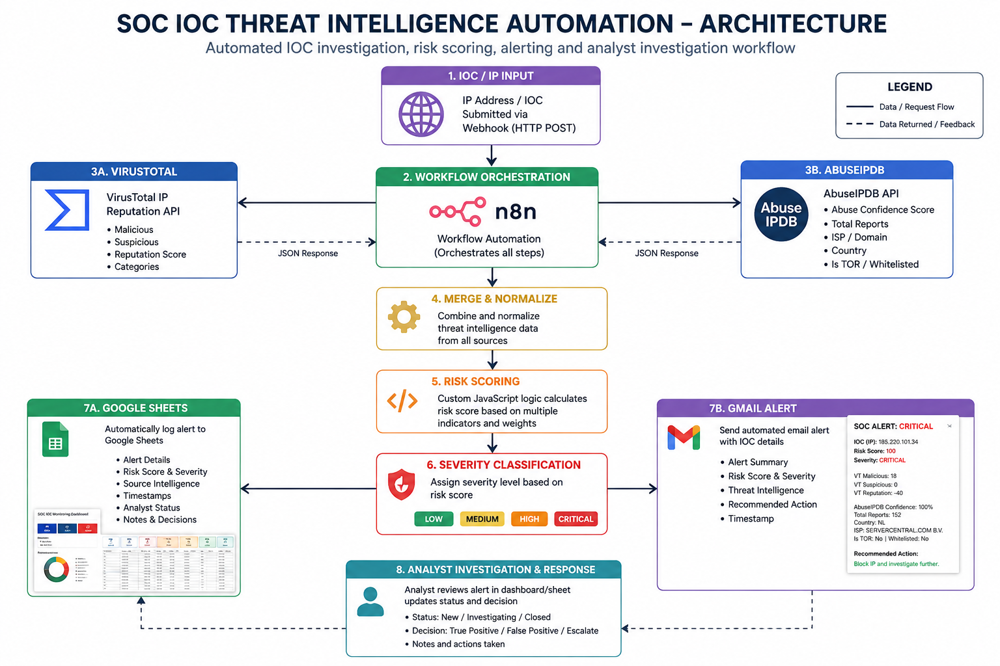
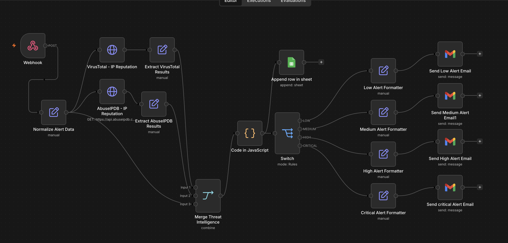
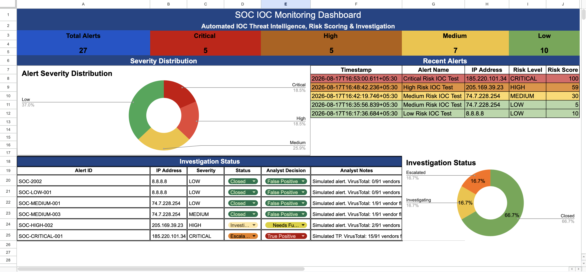

# SOC IOC Threat Intelligence Automation

An automated Security Operations Center (SOC) workflow designed to enrich IP-based Indicators of Compromise (IOCs), calculate risk scores, generate security alerts, and support analyst investigation.

The project uses n8n to orchestrate threat intelligence lookups against VirusTotal and AbuseIPDB, processes the returned intelligence using custom risk-scoring logic, records investigation data in Google Sheets, and generates email alerts through Gmail.

> **Note:** This is a cybersecurity portfolio/lab project. Test alerts and investigation scenarios used in this repository are simulated and do not represent a production SOC environment.

-----------------------------------

## Project Overview

SOC analysts often need to investigate suspicious IP addresses using multiple threat intelligence sources. Performing these lookups manually can be repetitive and time-consuming.

This project demonstrates how part of the IOC triage process can be automated while retaining analyst decision-making for investigation and escalation.

The workflow performs the following process:

1. Receives an IP address through a webhook.
2. Queries VirusTotal for IP reputation information.
3. Queries AbuseIPDB for abuse intelligence.
4. Combines and normalizes the threat intelligence results.
5. Calculates a risk score based on multiple indicators.
6. Classifies the IOC as LOW, MEDIUM, HIGH, or CRITICAL.
7. Records the results in Google Sheets.
8. Generates an automated email alert.
9. Provides a dashboard for monitoring alerts and tracking analyst investigations.

---

## Architecture

The workflow integrates multiple threat intelligence and automation components to perform IOC enrichment, risk assessment, alerting, and analyst investigation.

---

## Workflow Implementation

The automation was implemented in n8n using a webhook-driven workflow. Incoming IP addresses are enriched using VirusTotal and AbuseIPDB, after which the returned threat intelligence is normalized and merged.

Custom JavaScript logic calculates the IOC risk score, and a Switch node classifies the result into LOW, MEDIUM, HIGH, or CRITICAL severity levels. Investigation results are logged in Google Sheets, while severity-specific email alerts are generated automatically through Gmail.

---

## Risk Scoring Methodology

Threat intelligence collected from VirusTotal and AbuseIPDB is normalized and evaluated using custom JavaScript logic in n8n.

The risk score is calculated using multiple indicators rather than relying on a single threat intelligence source.

| Indicator | Scoring Logic |
|---|---|
| VirusTotal malicious detections | 10 points per detection, maximum 40 |
| VirusTotal suspicious detections | 5 points per detection, maximum 10 |
| AbuseIPDB confidence score | Weighted contribution up to 40 points |
| AbuseIPDB reports ≥ 20 | +5 points |
| AbuseIPDB reports ≥ 100 | +10 points |
| Tor exit node | +10 points |
| Whitelisted IP | -20 points |

The resulting score is used to classify the IOC into four severity levels:

| Risk Score | Severity |
|---|---|
| 0–19 | LOW |
| 20–39 | MEDIUM |
| 40–69 | HIGH |
| 70+ | CRITICAL |

This scoring model was developed for this portfolio/lab environment and is intended to demonstrate multi-source IOC correlation and automated risk prioritization. It should not be treated as a production threat-scoring model.

## Technologies Used

- n8n
- VirusTotal API
- AbuseIPDB API
- JavaScript
- REST APIs
- Webhooks
- JSON
- Google Sheets
- Gmail
- Threat Intelligence
- IOC Analysis

---

## Key Features

- Automated IP reputation enrichment
- Multi-source threat intelligence correlation
- Custom IOC risk-scoring logic
- LOW, MEDIUM, HIGH, and CRITICAL severity classification
- Automated alert logging
- Email-based SOC notifications
- SOC monitoring dashboard
- Analyst investigation status tracking
- Analyst decision recording
- Investigation notes and escalation tracking

---

---

## SOC Monitoring Dashboard

The investigation results are recorded in Google Sheets and presented through a SOC monitoring dashboard, providing a centralized view of IOC alerts and analyst investigation activities.

The dashboard provides:

- Total alert count and severity-based KPI indicators
- Alert severity distribution
- Recent IOC alerts with IP addresses and risk scores
- Investigation status tracking
- Analyst decisions such as False Positive, Needs Further Investigation, and True Positive
- Analyst investigation notes and escalation tracking

---

## Project Status

Core workflow, automated threat intelligence enrichment, risk scoring, severity-based alerting, Google Sheets logging, and SOC investigation dashboard are operational.

The repository documents a completed portfolio implementation using simulated IOC investigation scenarios.
